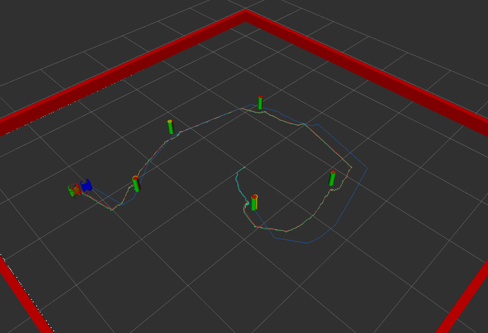

# ME495 Sensing, Navigation and Machine Learning For Robotics
* Kyle Thompson
* Winter 2026
# Package List
This repository consists of several ROS packages
- <nuturtle_description> - Holds the XACRO/URDF description of turtlebot and launchfiles to open them in rviz.
- <turtlelib> - Geometry and transforms library with svg visualization
- <nusim> - Sets up the simulated environment and outputs for the turtlebot simulation

Homework 2 Circle Robot Video:

https://github.com/user-attachments/assets/24e11844-0caa-4965-83b5-c910ac92b1f7

Odom error:

x: 0.1308321191316738
y: 0.04392329900151747
z: 0.0

Homework 3 SLAM screenshot:

