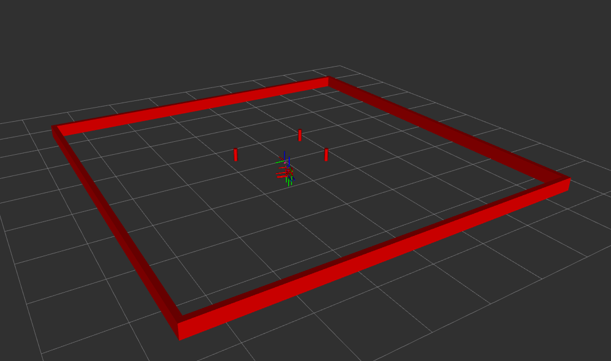

# Nusim Description
Used as a simulator and visualizer for the turtlebot
* `ros2 launch nusim nusim.launch.xml` to see the robot and arena in rviz

# Launch File Details
x0: Initial x position of turtlebot
y0: Initial y position of the turtlebot
theta0: Initial angle of the turtlebot
obstacles:
    x: array of cylinder x positions
    y: array of cylinder y positions
    r: cylinder radius
arena_x_length: x length of the arena walls
arena_y_length: y length of the arena walls