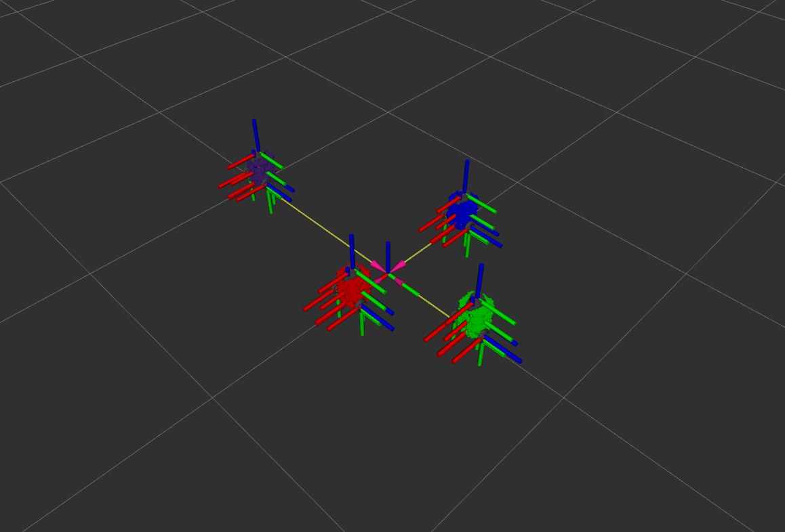
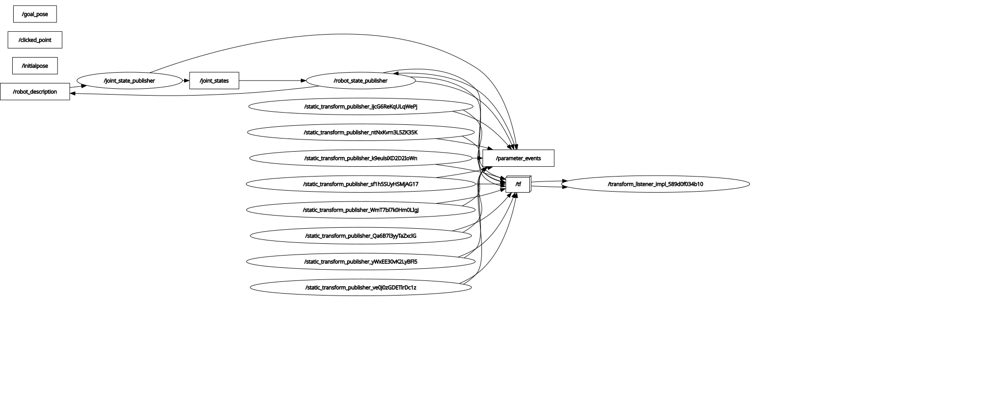

# Nuturtle  Description
URDF files for Nuturtle <Name Your Robot>
* `ros2 launch nuturtle_description load_one.launch.xml` to see the robot in rviz.
* `ros2 launch nuturtle_description load_all.launch.xml` to see four copies of the robot in rviz.

* The rqt_graph when all four robots are visualized (Nodes Only, Hide Debug) is:

# Launch File Details
* `ros2 launch nuturtle_description load_one.launch.xml --show-args`
  Arguments (pass arguments as '<name>:=<value>'):

    'use_jsp':
        no description given
        (default: 'true')

    'use_rviz':
        no description given
        (default: 'true')

    'color':
        no description given
        (default: 'purple')
* `ros2 launch nuturtle_description load_all.launch.xml --show-args`
  Arguments (pass arguments as '<name>:=<value>'):

    'use_jsp':
        no description given
        (default: 'true')

    'use_rviz':
        no description given
        (default: 'true')

    'color':
        no description given
        (default: 'purple')